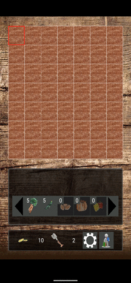

# GardenGiant

A Project that I implemented for the Mobile Application course in University.

Description: The app emulates a virtual garden.
Players own a space of around 5x5 tiles, each of which can be populated with plant seeds.
Plants take time to grow and are subsequently harvestable.
Crops can be sold to Non-Player-Characters which is important for progression, as rare plant seeds require a certain amount of capital.
